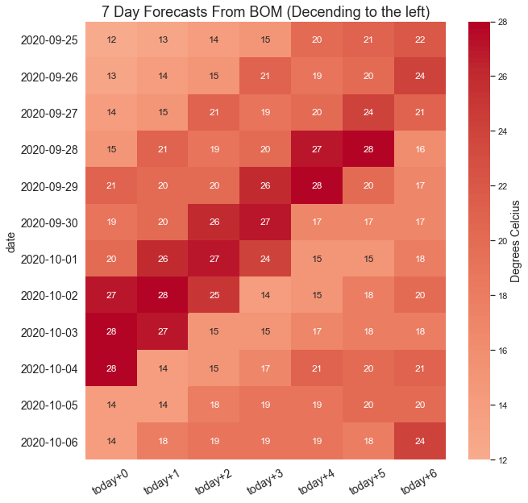
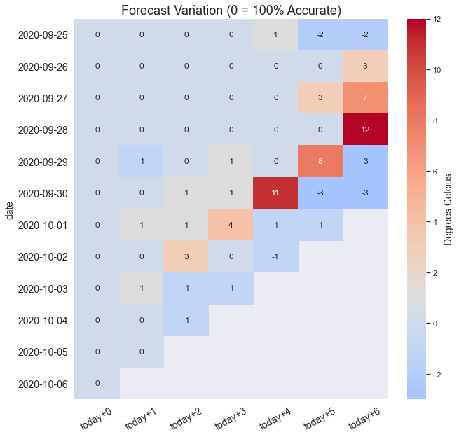

# BOM's Melbourne Forecast Accuracy

## Introduction

#### Evaluating the accuracy of the Bureau of Meteorology 6 day forecast.
The following information is an examination of the Bureau of Meteorology's 6-day forecast.

It's hard to know if a forecast is good because it depends on how 'good' is measured. Is accurate to within 1º good? How about within 5º?

This project is evaluating how adjusted forecasts are, depending on how many days away the forecast is. So instead of comparing to the historical temperatures, this will just look at how much the forecast varies as the date gets closer.

Firstly, it looks at the error (Root Mean Squared Error or RMSE and Mean Absolute Error or MAE) of how correct/incorrect forecasts are by day (eg: how similar is the 3-day forecast compared to the same day forecast).

These two evaluations of error are slightly different, RMSE will give higer average error if there are more extreme values and MAE will give a lower error if there are more days with a slight error. 

Since we are looking at the weather, the more the forecast is off, the bigger the real-world impact, so for the purposes of this project, I prefer to use RMSE, but I've included both for comparison.

**Secondly,** the project evaluates at how accurate the forecast is against a naive forecasting approach, in this case the <a href=https://en.wikipedia.org/wiki/Weather_forecasting#Persistence>persistence model<a/> which is simply "The weather tomorrow will be the same as today" ie: the temperature will persist. This is a good way to evaluate model accuracy as this form of forecast naturally varies with changing weather, which makes it comparable to the difficulties typically faced in weather forecasting.

The persistence model, also called the naïve predictor, is often used as a reference as it is a good ground estimation of other algorithms, and often used as a reference for determining the skill factor of a competing forecast model.

After the persistence model is evaluated, historical weather data is used to try and improve upon the persistance model using Facebook Prophet and Random Forest Regressor.
The new forecast is saved to ben_vs_bom.csv and will be built upon over time.

* [**Part 1 is now live at ausforecast.app**](https://ausforecast.app)

## Data Integrity

The forecast from the BOM is updated every 10 minutes, so the forecast data is fetched at the same time each day.

The API json is then parsed and stored in a Postgres server for later manipulation.
For reasons unknown, the API sometimes delivers a 6 day forecast instead of 7 (perhaps day 7 falls outside a specific degree of confidence). To resolve this data is imputed taking the day 6 forecast the following day and retro-spectively adding to the data.

If the scheduler happens to miss an entire day, the last 5 values are taken from the previous  day and the 6th day is added the following day.

#### Note: This project is not evaluating the accuracy of the forecast to the real temperature obesrved on the day, but evaluating the variance in forecasts from the observation date to observation date +1, 2, 3.. etc.

## App Design

Due to higher processing requirements of the app as the database gets bigger, parts of the app have been 'offloaded' onto scheduled tasks, such as processing data from the database and generating charts. This has increased the responsiveness of the app and made it less prone to connection failures.

## Data Dictionary For Static/Data

| File | Description |
| :--- | :--- |
| forecast_dataframe.csv | Table of temp_max forecasts |
| accuracy_dataframe.csv | Table of forecast difference from "today+0" |
| persistence_dataframe.csv | Table of forecast difference with "today+0" replaced with persistence |
| prophet_dataframe.csv | Predicted values by the Facebook Prophet timeseries forecaster |

## Data Dictionary For Static/Data/training_data

####  weather.csv
| Field | Description |
| :--- | :--- |
| date | date of observation |
| quality_rf | see rainfall_notes.txt |
| max_temp_c | The maximum temperature observed |
| quality_mt | see max_temps_notes.txt. |
| uv_index | Solar Exposure converted to UV index via straight linear conversion. |

####  rainfall.csv
| Field | Description |
| :--- | :--- |
| bureau of meteorology station number | ID number for Melbourne Olympic Park weather observatory |
| year | Year of observation |
| month | Month of observation |
| day | Day of observation |
| rainfall amount (millimetres) | Observed rain in mm |
| period over which rainfall was measured (days) | period over which rainfall was measured (days) |
| quality | Y (yes) or N (no) |

####  max_temps.csv
| Field | Description |
| :--- | :--- |
| bureau of meteorology station number | ID number for Melbourne Olympic Park weather observatory |
| year | Year of observation |
| month | Month of observation |
| day | Day of observation |
| maximum temperature (degree c) | Maximum temperature observed in ºC |
| days of accumulation of maximum temperature | Days of accumulation of maximum temperature |
| quality | Y (yes) or N (no) |

####  solar_exposure.csv
| Field | Description |
| :--- | :--- |
| bureau of meteorology station number | ID number for Melbourne Olympic Park weather observatory | 
| year | Year of observation |
| month | Month of observation |
| day | Day of observation |
| daily global solar exposure (mj/m * m) | Daily global solar exposure (mj/m * m) |

## Important Links

* [Final Report Notebook](report.ipynb)
* [EDA Notebook](eda.ipynb)
* [BOM Data](ftp://ftp.bom.gov.au/anon/gen/fwo/) - XML files for all weather reports in Australia. (ftp link)
* [Melbourne Forecast File](ftp://ftp.bom.gov.au/anon/gen/fwo/IDV10450.xml) - The Melbourne forecast file. (ftp link)
* [BOM API](https://api.weather.bom.gov.au/v1/locations/r1r143/forecasts/daily) - API data. Be aware the feed is updated every 10mins.
* [fbprophet](https://facebook.github.io/prophet/docs/quick_start.html) - Facebook Prophet timeseries forecasting package.
* [Random Forest Regressor](https://scikit-learn.org/stable/modules/generated/sklearn.ensemble.RandomForestRegressor.html) - Scikit Learn's Random Forest Regressor.
