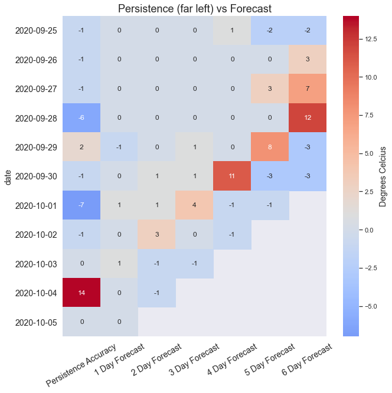

# Persistance Model of BOM Weather

## Introduction

We often get a 7 day weather forecast but don't often go back to see how accurate the predictions were for 7 days ago.
This project looks to explore how accurate the weather forecast is according to a what is known as the Persistance Model.
The Persistance Model hypothesis for the weather domain is that "The weather tomorrow will be the same as today",   
or in mathematical terms Weather(t+1) = Weather(t), (t being today, or time).

The forecasts are already known to be very accurate for t = 1,2 and 3, so for this project I will be looking at t+7.

The persistence model, also called the naïve predictor, is often used as a reference as it is a good ground estimation of other algorithms,   
and often used as a reference for determining the skill factor of a competing forecast model.

After the persistence model is evaluated, historical weather data is used to try and improve upon the persistance model using Facebook Prophet and Random Forest Regressor.
The new forecast is saved to ben_vs_bom.csv and will be built upon over time.

* [Part 1 is now live](https://github.com/bfgdigital/BOM_Weather) - bom_app.py & scheduler.py on Heroku via Streamlit & Postgres.

**Updated to a 2 day forecast.**

## Data Dictionary

####  temps.csv & (temps_multi.csv with multiple locations)
| Field | Description |
| :--- | :--- |
| today+0 | Todays weather |
| today+1 | The forecast for tomorrow's weather |
| today+2 | the forecast for 2 days from now. |
...

####  weather.csv
| Field | Description |
| :--- | :--- |
| date | date of observation |
| quality_rf | see rainfall_notes.txt |
| max_temp_c | The maximum temperature observed |
| quality_mt | see max_temps_notes.txt. |
| uv_index | Solar Exposure converted to UV index via straight linear conversion. |

####  rainfall.csv
| Field | Description |
| :--- | :--- |
| bureau of meteorology station number | ID number for Melbourne Olympic Park weather observatory |
| year | Year of observation |
| month | Month of observation |
| day | Day of observation |
| rainfall amount (millimetres) | Observed rain in mm |
| period over which rainfall was measured (days) | period over which rainfall was measured (days) |
| quality | Y (yes) or N (no) |

####  max_temps.csv
| Field | Description |
| :--- | :--- |
| bureau of meteorology station number | ID number for Melbourne Olympic Park weather observatory |
| year | Year of observation |
| month | Month of observation |
| day | Day of observation |
| maximum temperature (degree c) | Maximum temperature observed in ºC |
| days of accumulation of maximum temperature | Days of accumulation of maximum temperature |
| quality | Y (yes) or N (no) |

####  solar_exposure.csv
| Field | Description |
| :--- | :--- |
| bureau of meteorology station number | ID number for Melbourne Olympic Park weather observatory | 
| year | Year of observation |
| month | Month of observation |
| day | Day of observation |
| daily global solar exposure (mj/m * m) | Daily global solar exposure (mj/m * m) |

####  ben_vs_bom.csv
| Field | Description |
| :--- | :--- |
| Persistence | Today's temperature as a prediction of tomorrows temperature. |
| Prophet | FB Prophets prediction of tomorrow's temperature (regression). |
| RandomForest | Random Forest prediction of tomorrows temperature. |
| Bens Best Guess | Average of above three predictions. |
| BOM Forecast | Bureau Of Meterology's forecast for tomorrows temperature. |

####  Forecast Records
| Field | Description |
| :--- | :--- |
| Multiple Files | A saved dump of api forecast data as it is not saved on the BOM |

## Important Links

* [Final Report Notebook](report.ipynb)
* [EDA Notebook](eda.ipynb)
* [BOM Data](ftp://ftp.bom.gov.au/anon/gen/fwo/) - XML files for all weather reports in Australia. (ftp link)
* [Melbourne Forecast File](ftp://ftp.bom.gov.au/anon/gen/fwo/IDV10450.xml) - The Melbourne forecast file. (ftp link)
* [BOM API](https://api.weather.bom.gov.au/v1/locations/r1r143/forecasts/daily) - API data. Be aware the feed is updated every 10mins.
* [fbprophet](https://facebook.github.io/prophet/docs/quick_start.html) - Facebook Prophet timeseries forecasting package.
* [Random Forest Regressor](https://scikit-learn.org/stable/modules/generated/sklearn.ensemble.RandomForestRegressor.html) - Scikit Learn's Random Forest Regressor.
